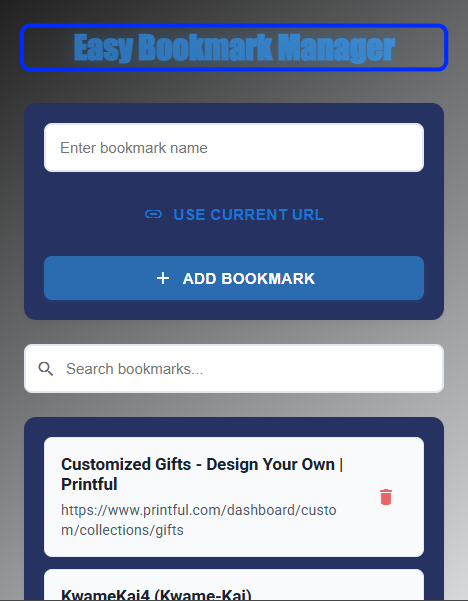

# Easy Bookmark Manager Chrome Extension

A sleek, user-friendly Chrome extension for managing bookmarks with Material Design styling and smooth interactions.



## Features

- **One-Click Bookmarking**: Instantly save the current page with a single click
- **Auto-Fill Page Details**: Automatically captures page title and URL
- **Smart Search**: Filter bookmarks by title or URL
- **Material Design UI**: Clean, modern interface with smooth animations
- **Synced Storage**: Bookmarks sync across devices using Chrome's sync storage
- **Responsive Layout**: Comfortable viewing with custom scrollbars and spacing

## Installation

1. Open Chrome and navigate to `chrome://extensions/`
2. Enable "Developer mode" in the top right
3. Click "Load unpacked" and select the `bookmark-manager` folder
4. The extension icon will appear in your Chrome toolbar

## Usage

### Adding Bookmarks

1. Click the extension icon while on any webpage
2. The page title will be auto-filled
3. Click "Use Current URL" to instantly add the current page
4. Alternatively, enter a custom name and submit the form

### Managing Bookmarks

- **Search**: Type in the search box to filter bookmarks
- **Open**: Click any bookmark to open it in a new tab
- **Delete**: Click the trash icon to remove a bookmark
- **Sync**: Bookmarks automatically sync across your Chrome instances

## Technical Details

### File Structure
```
bookmark-manager/
├── manifest.json        # Extension configuration
├── popup.html          # Main UI structure
├── popup.js           # Core functionality
├── styles.css         # Material Design styling
└── icons/             # Extension icons
    └── icon16.png     # Toolbar icon
```

### Technologies Used

- **Chrome Extension APIs**
  - `chrome.storage.sync` for cross-device bookmark syncing
  - `chrome.tabs` for current tab information
- **Material Design**
  - Custom Material UI components
  - Material Icons for visual elements
- **Modern JavaScript**
  - ES6+ features
  - Event-driven architecture
  - Promise-based async operations

### Design Features

- Soft gradient backgrounds for visual comfort
- Smooth animations and transitions
- Custom scrollbar styling
- Responsive hover states
- Carefully selected typography and spacing
- High contrast for accessibility
- Subtle shadows for depth perception

## Development

### Local Setup

1. Clone the repository
2. Make desired changes to the source files
3. Load the extension in Chrome using "Load unpacked"
4. Any changes to the files will require reloading the extension

### Key Files

- **manifest.json**: Defines extension permissions and resources
- **popup.html**: Contains the extension's UI structure
- **popup.js**: Handles all bookmark operations and user interactions
- **styles.css**: Implements Material Design styling and animations

### Storage Structure

Bookmarks are stored in Chrome's sync storage with the following format:

```javascript
{
  bookmarks: [
    {
      name: "Bookmark Title",
      url: "https://example.com",
      date: "2024-04-09T20:54:23.000Z"
    }
    // ...more bookmarks
  ]
}
```

## Contributing

1. Fork the repository
2. Create a feature branch
3. Make your changes
4. Test thoroughly
5. Submit a pull request

## License

MIT License - feel free to use and modify as needed!

## Credit

Created with ❤️ using Material Design principles and Chrome Extension APIs.
